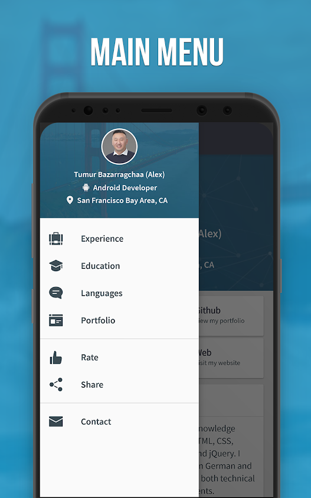
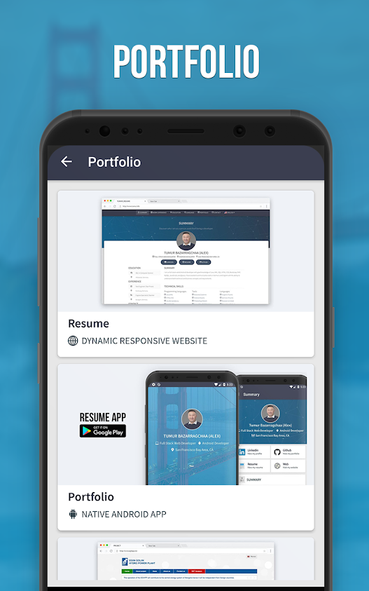
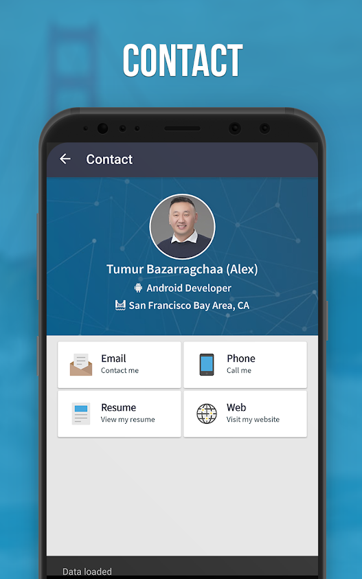

Personal Resume Android App
-----------------------

Personal Resume Android is an open-source and native Android applicaton which is mobile version of [My Personal Website](http://tumur.info), and it fetches personal information from [Web Service RestAPI](https://github.com/tumurb/Personal-Resume-Android-API) | Available on Github. This project was developed for the Android SDK Development of my independent studies. 

  

## Screenshots

  

## Custom Design

  

## Source Code

  

## Download APK
You can download the apk from: 

1. [Google Playstore](https://play.google.com/store/apps/details?id=info.tumur.resume.app)
2. [Github Release](https://github.com/tumurb/Personal-Resume-Android/blob/master/app/release/Resume%201.2.apk)

## Requirements
* JDK Version 1.7 & above
* [Android SDK.](http://developer.android.com/sdk/index.html)
* Android SDK Tools
* Android SDK Build tools 27
* Android Support Repository
* Android Support library

## Google Play Services Setup.
This project uses Firebases Analytics and Crashlytics. You will need to generate the configuration file (`google-services.json`) and copy it to your `/app` dir. See links below

1. [Setup Firebase setup](https://firebase.google.com/docs/android/setup)
2. [Setup Firebase Analytics](https://firebase.google.com/docs/analytics/android/start/)
3. [Setup Firebase Crashlytics](https://firebase.google.com/docs/crashlytics/get-started/)

## Project Setup

This project is built with Gradle, the [Android Gradle plugin](http://tools.android.com/tech-docs/new-build-system/user-guide) Clone this repository inside your working folder. Import the `settings.gradle` file in the root folder into e.g. Android Studio. (You can also have a look at the `build.gradle` files on how the projects depend on another.)

* Start Android Studio
* Select "Open Project" and select the generated root Project folder
* You may be prompted with "Unlinked gradle project" -> Select "Import gradle project" and select
the option to use the gradle wrapper
* You may also be prompted to change to the appropriate SDK folder for your local machine
* Once the project has compiled -> run the project!

Contributing
============

#### Would you like to contribute code?

1. [Fork Personal-Resume-Android](https://github.com/tumurb/Personal-Resume-Android).
2. Create a new branch ([using GitHub](https://help.github.com/articles/creating-and-deleting-branches-within-your-repository/)) or the command `git checkout -b branch-name dev`).
3. [Start a pull request](https://github.com/tumurb/Personal-Resume-Android/compare). Reference [existing issues](https://github.com/tumurb/Personal-Resume-Android/issues) when possible.

#### No code!
* You can [discuss a bug](https://github.com/tumurb/Personal-Resume-Android/issues) or if it was not reported yet [submit a bug](https://github.com/tumurb/Personal-Resume-Android/issues/new).

Libraries Used
============

1. [Retrofit](http://square.github.io/retrofit/)
2. [OkHttp](https://github.com/square/okhttp)
3. [Glide](https://github.com/bumptech/glide)
4. [Android SpinKit](https://github.com/ybq/Android-SpinKit)
5. [Material Ripple](https://github.com/balysv/material-ripple)
6. [CircularImageView](https://github.com/lopspower/CircularImageView)

License
-------

    Copyright 2018 Tumur.B (Alex)

    Licensed under the Apache License, Version 2.0 (the "License");
    you may not use this file except in compliance with the License.
    You may obtain a copy of the License at

       http://www.apache.org/licenses/LICENSE-2.0

    Unless required by applicable law or agreed to in writing, software
    distributed under the License is distributed on an "AS IS" BASIS,
    WITHOUT WARRANTIES OR CONDITIONS OF ANY KIND, either express or implied.
    See the License for the specific language governing permissions and
    limitations under the License.

